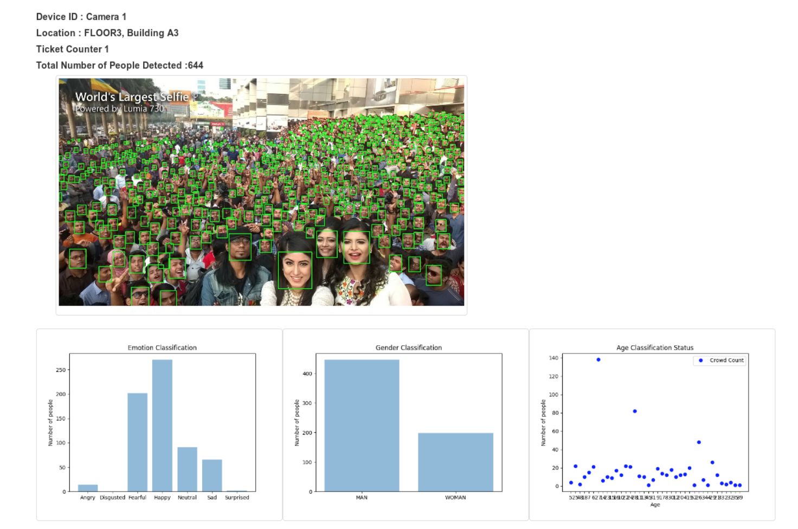

# MLT x 2020

More than half a million people are expected to come to Tokyo for the Olympics 2020. We built a highly scalable system for face detection and count, age, gender and emotion prediction for 

* managing crowds, 
* making personalized recommendation for users and 
* optimizing marketing campaigns and ad placement (e.g. ads on screens based on average age or gender). 

We combined 3 Deep Learning Models and 3 APIs (Twitter, Google Maps, Google Translate). This helps to facilitate Safety, Efficiency and Business Value for the Tokyo Olympics 2020.

**Presentation slides:** https://goo.gl/hBwi4U

# MLT Teams at Junction Tokyo

  

